## <picture><source media="(prefers-color-scheme: dark)" srcset="emoji/dark/hand-anim.svg"></picture> Hi there, I'm Can
### <picture><source media="(prefers-color-scheme: dark)" srcset="emoji/dark/cpu-anim.svg"></picture> Computer Engineer | Full Stack Developer
<picture><source media="(prefers-color-scheme: dark)" srcset="emoji/dark/laptop-anim.svg"></picture> I’m a Full Stack Developer passionate about building web applications. <picture><source media="(prefers-color-scheme: dark)" srcset="emoji/dark/target-anim.svg"></picture> Focused on Java, Spring Boot, and React. <picture><source media="(prefers-color-scheme: dark)" srcset="emoji/dark/rocket-anim.svg"></picture> Always eager to learn, collaborate, and grow as a developer.

  <a href="https://discord.gg/SnphaaU"><picture><source media="(prefers-color-scheme: dark)" srcset="badges/dark/discord.svg"></picture></a>
  <a href="https://www.twitch.tv/cannmeister"><picture><source media="(prefers-color-scheme: dark)" srcset="badges/dark/twitch-icon.svg"></picture></a>
  <a href="https://www.youtube.com/channel/UCUrLFcjG9F2m_oZxWiaJJDg"><picture><source media="(prefers-color-scheme: dark)" srcset="badges/dark/youtube-icon.svg"></picture></a>
  <a href="https://www.instagram.com/c.kocyigit/"><picture><source media="(prefers-color-scheme: dark)" srcset="badges/dark/instagram-icon.svg"></picture></a>

### <picture><source media="(prefers-color-scheme: dark)" srcset="emoji/dark/settings-anim.svg"></picture> Languages and Tools

  <picture><source media="(prefers-color-scheme: dark)" srcset="icons/dark/openjdk.svg"></picture>
  <picture><source media="(prefers-color-scheme: dark)" srcset="icons/dark/springboot.svg"></picture>
  <picture><source media="(prefers-color-scheme: dark)" srcset="icons/dark/typescript.svg"></picture>
  <picture><source media="(prefers-color-scheme: dark)" srcset="icons/dark/javascript.svg"></picture>
  <picture><source media="(prefers-color-scheme: dark)" srcset="icons/dark/react.svg"></picture>
  <picture><source media="(prefers-color-scheme: dark)" srcset="icons/dark/tailwindcss.svg"></picture>
  <picture><source media="(prefers-color-scheme: dark)" srcset="icons/dark/nodedotjs.svg"></picture>
  <picture><source media="(prefers-color-scheme: dark)" srcset="icons/dark/postgresql.svg"></picture>
  <picture><source media="(prefers-color-scheme: dark)" srcset="icons/dark/jest.svg"></picture>
  <picture><source media="(prefers-color-scheme: dark)" srcset="icons/dark/cypress.svg"></picture>
  <picture><source media="(prefers-color-scheme: dark)" srcset="icons/dark/docker.svg"></picture>
  <picture><source media="(prefers-color-scheme: dark)" srcset="icons/dark/html5.svg"></picture>
  <picture><source media="(prefers-color-scheme: dark)" srcset="icons/dark/css.svg"></picture>
  <picture><source media="(prefers-color-scheme: dark)" srcset="icons/dark/git.svg"></picture>
  <picture><source media="(prefers-color-scheme: dark)" srcset="icons/dark/github.svg"></picture>
  <picture><source media="(prefers-color-scheme: dark)" srcset="icons/dark/figma.svg"></picture>

<picture><source media="(prefers-color-scheme: dark)" srcset="activity-dark.svg"></picture>

